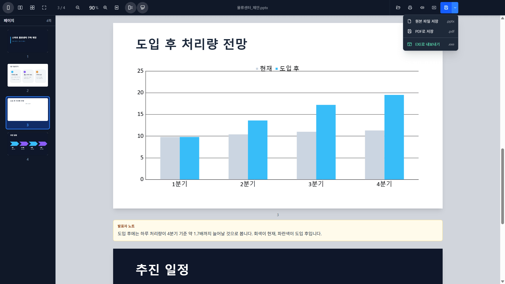
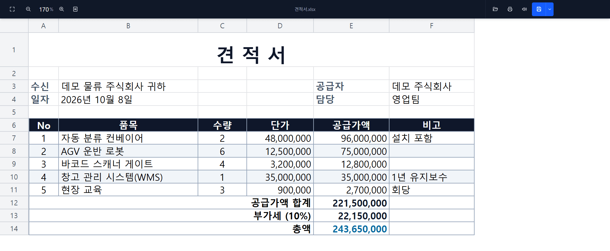
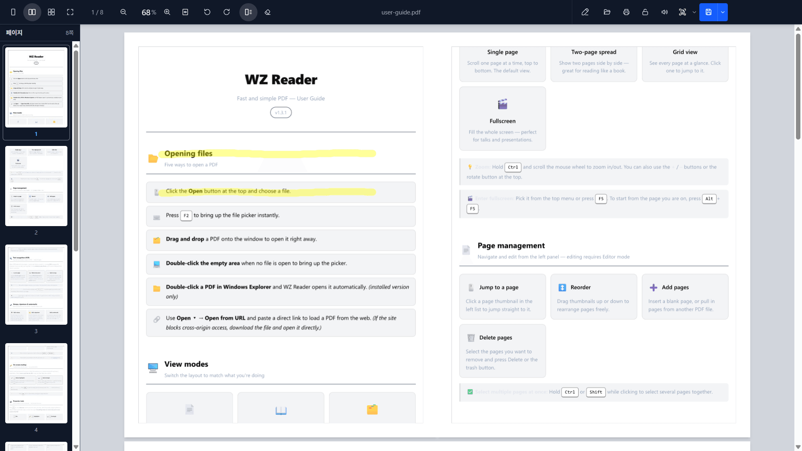
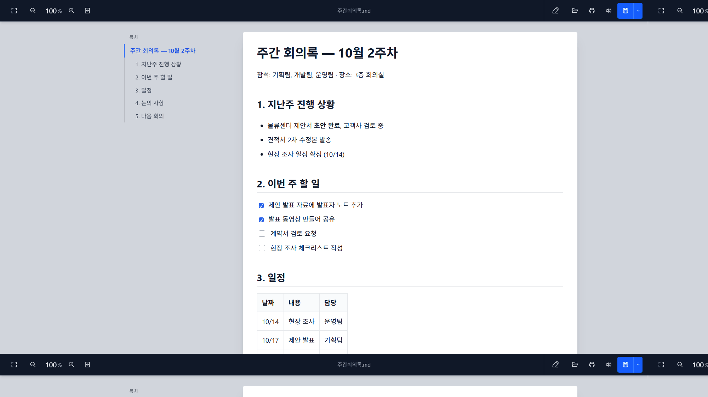

# WZ Reader

**Open PDF, Korean HWP, Word, PowerPoint, Excel, e-mail, images and Markdown — present, read aloud, annotate, OCR and convert. 100% in your browser. No upload.**

Introduce : https://whyzoo.com/WzPDF/ · Demo : https://whyzoo-lab.github.io/WZ-PDF/ · Download : [Releases](https://github.com/whyzoo-lab/WZ-PDF/releases)

[](https://github.com/whyzoo-lab/WZ-PDF/releases)
[](./LICENSE)




<table>
  <tr>
    <td width="33%"></td>
    <td width="33%"></td>
    <td width="33%"></td>
  </tr>
  <tr>
    <td align="center"><sub>Excel without Excel</sub></td>
    <td align="center"><sub>PDF — two-page view, on-screen markup</sub></td>
    <td align="center"><sub>Markdown with a contents rail</sub></td>
  </tr>
</table>

<sub>Sample documents made for these screenshots.</sub>

> A presentation-focused viewer, editor, and distribution platform for the
> documents that actually land in your inbox.

*Called **WZ PDF** until 1.25.0 — it outgrew the name. Installed copies update
in place, and the program file is still `WZ PDF.exe`.*

WZ Reader is a fast, **fully client-side** document tool. Open a PDF, a Korean
`.hwp` / `.hwpx`, a Word document, a PowerPoint deck, a spreadsheet, a saved
e-mail (`.eml`), a Markdown file or an image — read it, find in it, present it
fullscreen, have it read aloud, mark it up, run OCR, and save it as a PDF with
real, selectable text. All in the browser or as a Windows desktop app.
**No backend, no upload: your file never leaves your machine.**

Built with React, Konva, pdfjs, pdf-lib and Electron, plus a Rust→WASM HWP
engine ([`@rhwp/core`](https://www.npmjs.com/package/@rhwp/core)), on-device OCR
and on-device speech. Ships with a
[Model Context Protocol](https://modelcontextprotocol.io) server so AI agents
(e.g. Claude) can read every format it opens and convert documents to PDF.

---

## Why WZ Reader

- 🔒 **Private by design** — everything runs in the browser/desktop. Nothing is uploaded.
- 📄 **PDF _and_ HWP/HWPX** — open Korean word-processor files exactly like a PDF, with **native selectable text** (no OCR needed).
- 📊 **Word, PowerPoint and Excel without Office** — `.docx`, `.pptx`, `.xlsx` / `.xlsm` / `.xls` / `.ods` / `.csv` open with their layout, tables, charts and pictures, with zoom, single / two-page / all-pages layouts, a page list, find, print and fullscreen. **Every row** of a 200,000-row sheet scrolls — nothing is cut short with "open it in Excel". Save any of them **as a PDF with selectable text**.
- 🎤 **Speaker notes, on screen and read aloud** — a deck's presenter script shows under each slide; in the slideshow it runs along the bottom as **captions** (`C` or the corner button), and read-aloud reads the script instead of the slide, **turning the slides as it goes**. `Alt+F5` starts the show from the slide in view.
- 🎬 **A deck with notes becomes a narrated video** — one MP4: the slides, the script read aloud in a natural voice, and the script as a subtitle track that any player can switch on and off.
- 🔊 **Reads documents aloud, on your machine** — press the speaker and the document is read to you, Korean included, with ten voices and a speed control; the sentence being read is highlighted, and in fullscreen the pages turn with it. It runs entirely offline once set up: nothing about what you are reading leaves the computer. (Desktop app; the voice model is a one-time 383 MB download you are asked about first.)
- 🔁 **HWP → PDF that you can actually copy from** — the converted file carries a real text layer, so text stays selectable and searchable in any reader. Not a picture of a document.
- 🔐 **Password-protected PDFs** — opens them (asking for the password), and saves them locked (AES-256) or unlocked: the padlock in the toolbar decides what the next save does.
- ✍️ **Stamps that remember** — upload your seal once: its white paper is removed, its size is kept, and it stays in **My stamps**. Stamp page after page with one click each, or copy it and paste it onto every selected page at once.
- ↩️ **Undo, and nothing lost by accident** — `Ctrl+Z` / `Ctrl+Y` take back stamps, signatures and page edits; opening another document or closing the window with unsaved changes asks first.
- 📦 **Any document → standalone `.exe`** — hand someone a single file that opens itself, carrying the document in its own format: a deck opens as a deck, with its slideshow and notes; a locked PDF still asks for its password. With stamps on it, it carries the PDF that includes them.
- 💾 **The same three saves for every format** — the original file, a PDF with selectable text (Markdown and mail included), and a viewer `.exe`.
- 📚 **Save as a booklet** — the two-page view becomes a PDF with two pages per sheet, ready to print and fold. Or save just the pages you selected.
- ✉️ **Open `.eml` mail** — headers, body and **attachments you can save or open**, with Korean encodings (EUC-KR bodies, encoded subjects and filenames) handled properly. Remote images are blocked until you ask, so opening a message doesn't report back to the sender.
- 🖼️ **Pictures, a folder at a time** — open one picture and the rest of its folder comes with it, paged through like a PDF; pick several at once or open a ZIP of pictures. jpg / png / gif / bmp / webp and **multi-page TIFF** (fax scans included); transparency and **animated GIFs** show as they are. Stamp, recognize text, reorder or delete pictures, and **save them all as one PDF** — JPEGs go in untouched.
- 📝 **Markdown as a document — and editable** — `.md` renders as a formatted page (headings, tables, code, task lists) with a contents rail that follows you as you scroll. Turn on editing (the pencil) and you get the raw source, tags and all, to edit and save back.
- 🖨️ **Mail, Markdown and Office print, zoom, search and present too** — they print as *text*, so the output stays sharp and selectable instead of being a picture of a page; `Ctrl+F` finds across them, and F5 puts them fullscreen with the same presenter tools as a PDF.
- 🐘 **Huge PDFs** — a document over 500 MB (up to about 2 GB) is read in pieces as you go instead of all at once, so it opens in seconds and stays light on memory (view only).
- ⌨️ **Batch converters on your PATH** — `topdf` (any format the app opens → PDF), `hwp2pdf`, `hwp2hwpx` and `hwpx2hwp` run from any terminal. Point them at files, wildcards or whole folders: `hwp2hwpx C:\docs\2026` walks the tree, and `-o` rebuilds that tree in the output folder instead of flattening it. Converted PDFs carry the same selectable text layer as saving from the app.
- 🎯 **Made for presenting** — fullscreen mode with ZoomIt-style presenter tools (pen, highlighter, arrow, laser pointer, spotlight zoom).
- 🔎 **On-device OCR** — recognize text in scanned pages and images, **fully offline** (Korean + English), and keep it: the recognized text is saved into the PDF, so it becomes searchable everywhere. Plus **Ctrl-drag any region → OCR → clipboard**.
- 🧩 **Embed anywhere** — drop the viewer into any website with a single `<iframe>` (see below), or run it in **private mode**: only the documents your server designates, view only.
- ⚡ **Starts fast, stays sharp** — the desktop app boots without waiting on code it isn't using yet, opens straight into a double-clicked document, and rasterises pages at the size they're shown so small text stays crisp.
- 🖥️ **Web + Windows desktop** — same app. The desktop build opens `.pdf`, `.hwp`, `.hwpx`, `.docx`, `.pptx`, `.xlsx`, `.xls`, `.csv`, `.eml`, `.md` and images by double-click, lists your recent documents, and **updates itself**.

## Download (Windows)

From [Releases](https://github.com/whyzoo-lab/WZ-PDF/releases):

| File | |
|---|---|
| `WZ_Reader_Setup_<version>.exe` | **Installer (recommended)** — shortcuts, file associations, the console converters, automatic updates. |
| `WZ_Reader_<version>.exe` | Portable single file — runs without installing, but unpacks itself on every start (~5 s) and does not update itself. |

## Embed the viewer in your site

Show a document inline on any page — no download, no plugin:

```html
<iframe
  src="https://whyzoo-lab.github.io/WZ-PDF/app.html?embed=1&url=DOCUMENT_URL"
  style="width:100%; height:80vh; border:0;"
  title="Document preview"
  allowfullscreen></iframe>
```

- `url` — the document to display (URL-encode it): PDF, HWP, Word, PowerPoint, Excel, Markdown, mail or an image. `embed=1` hides the editing chrome for a clean read-only viewer; drop it to open the full app.
- **CORS:** the web build fetches the file in the browser, so host the document on the **same origin** (or a CORS-enabled URL). The desktop app is not affected by CORS.
- Try it live on the [demo page](https://whyzoo-lab.github.io/WZ-PDF/), which embeds this viewer with a sample document and shows a copy-ready snippet for your deployment.

### Private mode — only the documents your server designates

`embed=1` is a convenience: whoever sees the page can edit the address and open
anything. For a viewer that shows **only what you chose, view only**, host the
web build yourself and put a `private.json` next to `app.html`. Every build
carries an example beside `app.html` —
[`private.example.json`](public/private.example.json) — that works as soon as it
is copied to that name. A live example runs on the
[demo page](https://whyzoo-lab.github.io/WZ-PDF/).

```json
{
  "documents": {
    "rfp":    "docs/RFP-2026.pdf",
    "notice": { "url": "/files/get?id=17", "name": "notice.hwp" }
  },
  "print": false
}
```

```html
<iframe src="https://your-site/viewer/app.html?doc=rfp" style="width:100%; height:80vh; border:0;" allowfullscreen></iframe>
```

- The viewer then opens **only** those documents (`?doc=` picks one; with a single document it may be left out). A file picked or dropped, `?url=`, a mail attachment — all refused.
- Zoom, fit, rotation, page list, two-page and grid views, fullscreen, find and OCR work. **Editing, saving and opening other documents do not** — their keyboard shortcuts included — and printing is off unless `"print": true` (printing is also "save as PDF").
- Paths are resolved against `private.json`, so relative ones stay on your server. `name` supplies the file name (with its extension) when the URL has none.
- It is a property of the deployment, not of the link: there is no URL switch to remove. A `private.json` that exists but cannot be read keeps the viewer **closed**, never open.
- Redeploying must leave `private.json` in place: `deploy.example.bat` keeps it when it clears the server, and never uploads a local one. If you deploy another way, exclude it the same way.
- It is not access control. The browser downloads the document to show it, so who may see it at all is your server's decision (sign-in); private mode keeps the viewer from being a way to open, change or save anything else.

---

## Features

### View & present
- **View modes** — single page, two-page spread (a wide page among narrow ones
  gets a row of its own), a grid overview that fills the window, and a
  presentation **fullscreen** mode (USB-clicker friendly, touchpad swipe,
  click-to-advance, `Home`/`End` jumps). `F5` presents from the start,
  `Alt+F5` from the page in view.
- **Presenter tools** (fullscreen, ZoomIt-style) — pen (`P`), highlighter (`H`),
  rectangle (`R`), arrow (`A`), laser pointer (`L`), and spotlight zoom (`Z`);
  color `1`–`5`, width `[` `]`, undo `Ctrl+Z`, erase `E`. Two-step `ESC`.
- **On-screen markup** (any mode) — yellow highlighter (`1`) and red rectangle
  (`2`) for quick emphasis; never written to the file, cleared with `ESC`.
- **Sharp rendering** — pages rasterize to match zoom × display density, so small
  slides and HiDPI screens stay crisp; **fit width** in one click when you want
  the text bigger.

### Word, PowerPoint & spreadsheets
- **Word** (`.docx`) — pages as Word lays them out, with headers, footers and
  bullets; a document Word never paginated is split into real pages.
- **PowerPoint** (`.pptx`) — slides with their tables, charts and pictures,
  checked against PowerPoint's own rendering. Speaker notes under each slide,
  captions in the slideshow, hidden slides skipped.
- **Narrated video** — a deck with notes saves as one MP4 (H.264 + AAC) with
  the script as a switchable subtitle track. Desktop app.
- **Spreadsheets** (`.xlsx` `.xlsm` `.xls` `.ods` `.csv`) — column widths,
  fonts, fills, borders, number formats, merged cells, hidden sheets, pictures
  (a logo, a company seal), every row of a very large sheet. Korean CSV in
  CP949 opens correctly.
- **Save as PDF** — with selectable text, at each page's own size: a deck at
  slide size, a sheet laid out as Excel would print it.

### Text, search & OCR
- **Select & copy text** — real selectable text layer over PDF pages, and
  **native selectable text for HWP/HWPX** (no OCR required). In Editor mode,
  double-click to edit text via an inline overlay.
- **Search** — `Ctrl+F` find across the document (works on OCR text too).
- **OCR** — recognize text in scanned/image pages, **100% on-device and offline**
  (Korean + English, PaddleOCR PP-OCRv5). `R` for this page, `RR` for the whole
  document. Saving the PDF keeps the recognized text in it.
- **Region OCR → clipboard** — hold **Ctrl and drag** to highlight any area; on
  release it's OCR'd and the text is copied to your clipboard.
- **Read aloud** (`S`) — speaks the document from the page you are on, a
  sentence at a time, using [Supertonic 3](https://huggingface.co/Supertone/supertonic-3)
  on-device. Ten voices, adjustable speed, previous / next sentence
  (`Alt+←` / `Alt+→`), and no audio or text ever sent anywhere. The voice model
  downloads once (383 MB) after you agree to it; everything after that works
  offline. Note that the model's weights are under the OpenRAIL-M licence
  rather than MIT — see [`THIRD_PARTY_NOTICES.md`](./THIRD_PARTY_NOTICES.md).
- **Follow along while it reads** — the sentence being spoken is highlighted and
  scrolls into view in every format; in a presentation the page or slide turns
  with it. **Scanned documents work too**: run OCR first and the recognized text
  is what gets read.
- **Screen readers** — named controls, headings per page, and announcements for
  OCR and reading, so a scanned document can be reached by ear.

### HWP / HWPX (Korean documents)
- View `.hwp` (binary) and `.hwpx` (XML) files through the **same pipeline as
  PDF** — annotations, OCR, print, and export all work unchanged.
- **HWP → PDF** — saving as PDF writes the pages with an invisible, selectable
  text layer, doubling as a converter.
- **HWP ⇄ HWPX** — `hwp2hwpx` and `hwpx2hwp` convert between the two formats
  from the command line. A measured round trip keeps the page count and every
  character of the text layer, and 120 documents convert in about 2 seconds.

### Annotate, manage & export
- **Annotate** (Editor mode) — stamps, hand-drawn signatures, text edits and
  full-page watermarks, written into the saved PDF. Korean text via an embedded
  Noto Sans KR subset.
- **My stamps** — uploaded stamps are cleaned up (white background removed,
  margins trimmed), kept with the size you last gave them, and stay armed for
  stamp after stamp. `Ctrl+C` / `Ctrl+V` pastes one onto the page under the
  pointer, or onto every page selected in the page list.
- **Undo / redo** — `Ctrl+Z`, `Ctrl+Y` for annotations and page edits; an amber
  dot marks unsaved changes, and you are asked before they could be lost.
- **Page management** — reorder (drag), insert blank / insert from another PDF,
  delete, with thumbnails. Annotations follow their pages automatically.
  Right-click → save the selected pages as a new PDF.
- **Passwords** — open encrypted PDFs; lock (AES-256) or unlock on save.
- **Export** — annotated PDF (`Ctrl+S`), booklet PDF (two pages per sheet),
  self-contained HTML viewer, page images (ZIP), and a standalone **Viewer
  EXE** (desktop build; the first export downloads its template once).
- **Print** — in-app WYSIWYG **print preview**; every page composited with
  annotations, aspect ratio preserved.

### App & platform
- **Open from anywhere** — file picker, drag-and-drop, OS file association
  (desktop), recent documents on the start screen, or **Open from URL**.
- **Automatic updates** — the installed app downloads a new version in the
  background (verified against its published hash) and installs it when you
  restart; it can be turned off on the start screen.
- **i18n** — UI and help auto-switch to Korean on Korean OS/browser locale,
  English everywhere else.
- **Responsive** — works on desktop, tablet, and phone.

## Quick start (web)

```bash
npm install
npm run dev:vite      # Vite dev server only (browser)
```

Open <http://localhost:5173>. (The root is the landing/demo page; the app itself is at `/app.html`.)

## Desktop app (Electron)

```bash
npm run dev           # compile Electron main + Vite + launch Electron
```

## Build

```bash
npm run build         # production web build → dist/
npm run build:exe     # Windows portable + NSIS installer → release/
```

`build:exe` regenerates the app icon from `public/icon.svg`, copies the HWP WASM
runtime, and runs two electron-builder passes (portable first, then NSIS). The
OCR and HWP binary assets are gitignored and regenerated at build time
(`npm run setup:ocr` needs Python + pyyaml; `npm run setup:hwp` runs
automatically). See [`CLAUDE.md`](./CLAUDE.md) for architecture and build details.

## Testing & quality

```bash
npm test              # Vitest (watch)
npm run test:run      # Vitest (single run)
npm run lint          # ESLint
```

## MCP server (optional)

`mcp/` contains a Model Context Protocol server with fifteen tools for
MCP-capable AI clients: read the text of **any format the app opens**
(`doc_get_text`, `doc_info` — PDF, HWP, Word, PowerPoint with speaker notes,
spreadsheets by rows, Markdown, mail), convert any of them to PDF exactly as
the app saves it (`doc_to_pdf`, `hwp_to_pdf`), and work on PDFs (info, text,
search, watermark, stamp, text overlay, split, merge, delete / reorder / insert
pages). The installer ships it ready to run on the app's own binary — no Node.js
install needed. It runs over stdio or HTTP (Streamable HTTP), writes only
`.pdf` files and never overwrites one unless asked. See
[`mcp/README.md`](./mcp/README.md).

## Deployment

- **GitHub Pages / static host** — the CI workflow builds and deploys the web app
  (and the demo landing) to Pages on every push to `main`. Any static host works:
  serve the `npm run build` output in `dist/`.
- **Self-host over SSH** — `deploy.example.bat` is a template for deploying to an
  nginx-served host. Copy it to `deploy.bat` (gitignored) and fill in your server,
  user, and paths.

Tagging `v*.*.*` triggers a GitHub Release that builds and publishes the Windows
installer + portable exe, and the `latest.yml` that installed copies update from.

## Tech stack

| Area | Tooling |
|---|---|
| UI | React 19, Tailwind CSS 4, Konva / react-konva |
| PDF | pdfjs-dist (render/text), @cantoo/pdf-lib + fontkit (save, encryption) |
| HWP / HWPX | @rhwp/core (Rust → WebAssembly) |
| Office | docx-preview (Word), @aiden0z/pptx-renderer (PowerPoint), hucre (spreadsheets) |
| Mail / Markdown | own MIME parser, marked, DOMPurify |
| OCR | onnxruntime-web + PaddleOCR PP-OCRv5 (offline, on-device) |
| Speech | Supertonic 3 + onnxruntime-node (offline, on-device) |
| Video | WebCodecs + mediabunny (MP4) |
| Desktop | Electron, electron-builder, electron-updater |
| Build/Test | Vite, TypeScript, Vitest, ESLint |
| Agents | @modelcontextprotocol/sdk |

## License

[MIT](./LICENSE). Third-party components and their licenses (Apache-2.0,
MPL-2.0, SIL OFL, MIT, etc.) are listed in
[`THIRD_PARTY_NOTICES.md`](./THIRD_PARTY_NOTICES.md).
